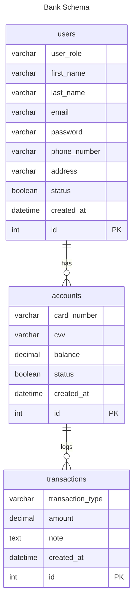

# Bank-System-Api

### ERD

```mermaid
---
title: Bank Schema
---

erDiagram
accounts {
varchar card_number
varchar cvv
decimal balance
boolean status
datetime created_at
int id PK
}
transactions {
varchar transaction_type
decimal amount
text note
datetime created_at
int id PK
}
users {
varchar user_role
varchar first_name
varchar last_name
varchar email
varchar password
varchar phone_number
varchar address
boolean status
datetime created_at
int id PK
}


users ||--o{ accounts : "has"
accounts ||--o{ transactions : "logs"
```